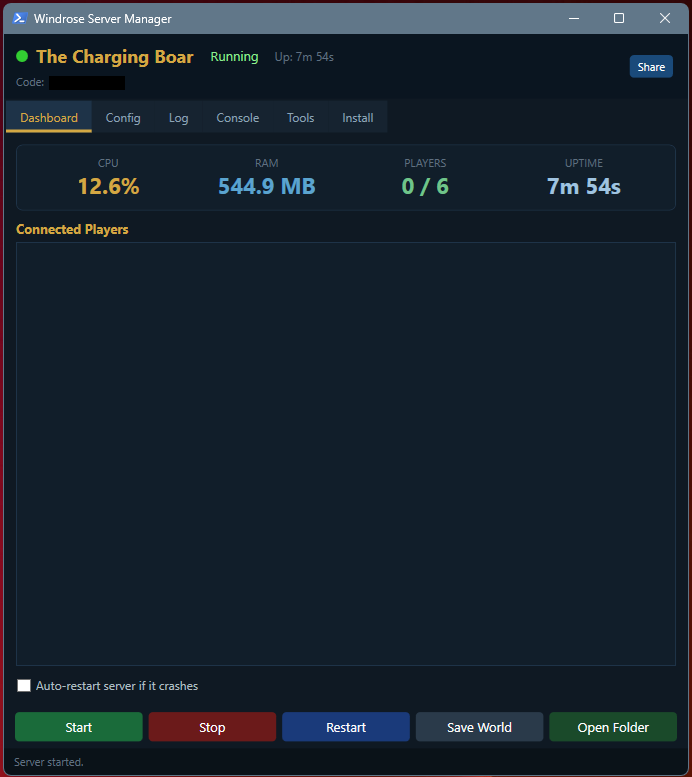

THIS IS NOT IN DEVELOPMENT ANYMORE. Please use the following: https://github.com/Andrew1175/Windrose-Server-Manager-Enhanced

# Windrose Server Manager

A local GUI application for running and managing a [Windrose](https://store.steampowered.com/app/3041230/Windrose/) dedicated server on Windows.



---

## Features

- **Steam and SteamCMD support** - You will be asked which method you want to use upon first launch with the ability to switch between the two in the settings.
- **One-click Start / Stop / Restart** with configurable countdown warning before restart
- **Live dashboard** — CPU usage, RAM, player count, uptime, and connected player list
- **Live log viewer** — color-coded, filterable (All / Players / Warnings / Errors) with auto-scroll
- **Console command input** — send commands directly to the server via Win32 console injection (save world, list players, kick, ban, and more)
- **Config editor** — edit server name, max players, password, and all world difficulty settings (preset or custom sliders) without touching JSON files
- **One-click world backup** — zips your save data to a timestamped archive
- **Auto-backup** — schedule automatic backups at 1, 4, 8, 16, or 24-hour intervals
- **Save on Stop** — optionally saves the world before stopping the server
- **Scheduled daily restart** — set a time; manager restarts the server automatically
- **Auto-restart on crash** — watchdog detects unexpected exits and relaunches automatically
- **Player history** — persistent log of who joined and left
- **Invite code share** — copies a ready-to-send message to clipboard
- **Self-updater** — checks GitHub for new versions and updates in-place
- **Install wizard** — A Guide that will walk you through the server setup process whether using Steam or SteamCMD
- **Patch notes** — built-in version history viewable from the Tools tab

---

## Requirements

- Windows 10 or Windows 11
- PowerShell 5.1 (built into Windows — no install needed)
- .NET Framework 4.5 or later (pre-installed on Windows 10+)
- **Windrose** owned and installed via Steam or SteamCMD (App ID 3041230)

> The dedicated server files are bundled inside the base Windrose game if using Steam. You do not need a separate dedicated server download.

---

## How to Run

### Steam Usage

1. **Install Windrose** on Steam and let it fully download.
2. **Download this repository** — click *Code > Download ZIP* on GitHub and extract it, or clone it:
   ```
   git clone https://github.com/Andrew1175/Windrose-Server-Manager.git "C:\Game-Servers\Windrose"
   ```
3. **Run `Launch.vbs`** — double-click it. You will be asked a few questions. Be sure to follow the prompts for Steam and NOT SteamCMD.
4. Switch to the **Dashboard** tab and click **Start**.

### SteamCMD Usage

1. **Download this repository** — click *Code > Download ZIP* on GitHub and extract it, or clone it:
   ```
   git clone https://github.com/Andrew1175/Windrose-Server-Manager.git "C:\Game-Servers\Windrose"
   ```
2. **Run `Launch.vbs`** — double-click it. You will be asked a few questions. Be sure to follow the prompts for SteamCMD and NOT Steam.
3. Follow the steps to download SteamCMD and the server files. The application will guide you and do this automatically.
4. Switch to the **Dashboard** tab and click **Start**.

---

## Tab Guide

| Tab | What it does |
|---|---|
| **Dashboard** | Live stats, player list, auto-restart toggle, save-on-stop option |
| **Config** | Edit `ServerDescription.json` and `WorldDescription.json` via form fields and sliders |
| **Log** | Live-tailing server log with color coding and filters (All / Players / Warnings / Errors) |
| **Console** | Send console commands to the running server, with quick-access buttons and live output |
| **Tools** | Manual and auto backup, scheduled restart, restart countdown, player history, patch notes |
| **Update** | Check for new versions and update the manager from GitHub |
| **Install** | Information to detect Steam/SteamCMD and server files |

---

## Console Commands

From the **Console** tab you can type Windrose server commands and send them to the running server. Quick-access buttons are provided for the most common commands:

| Button / Command | Effect |
|---|---|
| `save world` | Force-saves the world |
| `list players` | Prints connected players to the log |
| `logs` | Shows server log output |
| `quit` | Gracefully shuts down the server |
| `kick <name>` | Kicks a player by name |
| `ban <name>` | Bans a player by name |
| `reload world` | Reloads WorldDescription.json |
| `debug on` / `debug off` | Toggles debug output |

You can also right-click a player in the Dashboard player list to kick or ban them directly.

> Commands are delivered to the server via Win32 console input injection. The server must be started from the manager for this to work.

---

## Config Files

The manager edits these files on your behalf (always stops the server first):

| File | Location | Purpose |
|---|---|---|
| `ServerDescription.json` | `R5\` | Server name, max players, password, invite code |
| `WorldDescription.json` | `R5\Saved\SaveProfiles\...\Worlds\<id>\` | Difficulty preset and all gameplay multipliers |

> The server rewrites these files on exit. Always use the **Stop** button (not killing the process) to ensure a clean save.

---

## Backups

Click **Backup Saves Now** in the **Tools** tab to create a timestamped `.zip` of your entire world save. Backups are stored in the `Backups\` folder.

**Auto-backup:** Enable the "Auto-backup every" checkbox and select an interval (1, 4, 8, 16, or 24 hours). The next scheduled backup time is displayed below the controls. Auto-backups run as long as the manager window is open.

**Restore:** Stop the server, extract a backup zip over `R5\Saved\SaveProfiles\`, and restart.

---

## Port Forwarding

For players outside your local network to connect, forward these ports on your router:

| Protocol | Port |
|---|---|
| UDP | 7777 |
| UDP | 7778 |

Players join via **Play > Connect to Server** in Windrose, using the invite code shown in the manager header.

---

## Scheduled Restart

In the **Tools** tab, enable the scheduled restart and enter a time in `HH:mm` 24-hour format (e.g. `04:00`). The manager will automatically restart the server at that time once per day, respecting the restart countdown warning you configured.

> The manager window must be open for scheduled restarts to fire.

---

## Folder Structure

```
Windrose-Server-Manager\
├── Launch.vbs                        <- Double-click to open the manager (no terminal window)
├── Launch.bat                        <- Use this for debugging (shows errors in console)
├── Windrose-Server-Manager.ps1       <- Main application
├── README.md
├── Backups\                          <- World backup zips (created on first backup)
├── player_history.txt                <- Running player join/leave log
├── R5\
│   ├── ServerDescription.json        <- Server config (managed by app)
│   └── Saved\
│       ├── Logs\R5.log               <- Live server log (read by Log tab)
│       └── SaveProfiles\             <- World save data (backed up by Tools tab)
├── Engine\                           <- UE5 engine files (copied from Steam)
└── WindroseServer.exe                <- Server launcher (copied from Steam)
```

---

## Troubleshooting

**Manager window closes immediately**
Run `Launch.bat` from a Command Prompt to see the error (use this instead of Launch.vbs when debugging). Common causes: PowerShell execution policy, missing .NET Framework.

**CPU shows 0% / RAM shows very low**
This resolves after the first 3-second watchdog cycle. The stats compare two snapshots apart to calculate CPU usage.

**Invite code shows "loading..."**
The server takes ~30-60 seconds to register with Windrose's backend after launch. The code auto-populates once ready and can also be found in `R5\ServerDescription.json`.

**Console commands not working**
The server must be started from the manager for console command injection to work. If you started the server externally, stop it and relaunch from the manager's Dashboard tab.

**Players can't connect from outside your network**
Confirm UDP 7777 and 7778 are forwarded on your router and that Windows Firewall allows `WindroseServer-Win64-Shipping.exe` through.

---

## Contributing

Issues and pull requests welcome. Please open an issue before starting significant work.

---

## License

MIT — see [LICENSE](LICENSE) for details.
